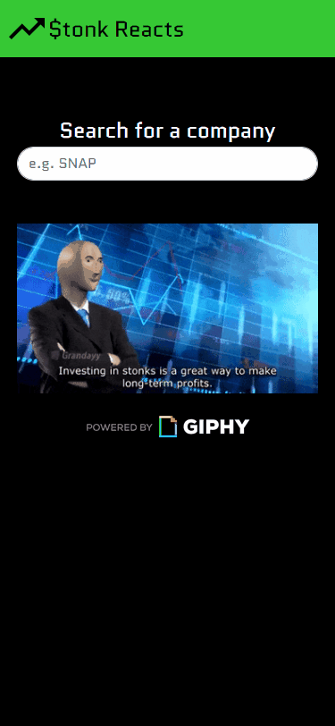
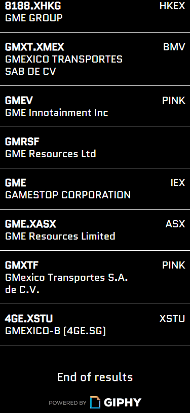

# Stonk Reacts
A hackathon project utilizing the data from the GIPHY and MarketStack APIs to provide a GIF reaction based on a stock's intraday performance.
https://stonkreacts.phutrieu.com

**Technologies**
* React.js
* HTML5
* CSS3
* JavaScript (ES6)
* Bootstrap 4
* Node.js
* AWS EC2
* Webpack 4

**Features**
* User can search for a company.
* User can view a list of search results.
* User can view stock details from a certain company.
* When viewing stock details, user can also view a GIF reaction based on the stock's intraday performance.

**Previews**

##### Search for a company




##### View stock details



**System Requirements**
* Node.js (10 or higher)
* NPM (6 or higher)

**Getting Started**
1. Clone the repository.
```shell
git clone https://github.com/phutrieu95/api-hackathon
```
2. Navigate to the directory.
```shell
cd api-hackathon
```
3. Install all dependencies needed.
```shell
npm install
```
4. Start the project. Once your system finishes compiling, you can view the application by opening http://localhost:8080 in your browser.
```shell
npm run start:dev
```
